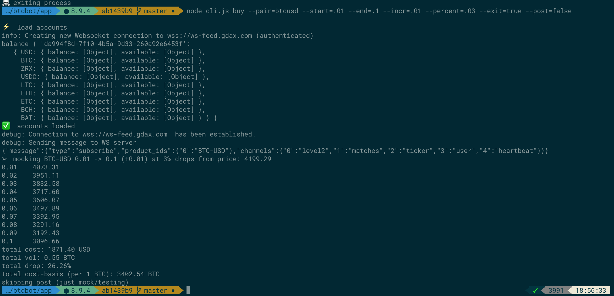

[Coinbase]: https://www.coinbase.com/join/antic

# Buy the Dip Bot (BTD Bot)

This is my own automated daemon for monitoring [Coinbase][Coinbase] prices and using my own API key to buy/sell bitcoin.
This is extremely experimental and not meant to act as a financial tool for others (though you are welcome to fork and experiment).
Currently, I am building up the simulator, which will create a report based on my strategy to show whether it works or not over a sample time in bitcoin market price history.

I am not a financial advisor, nor am I a professional market trader, nor a certified data scientist. Usage of this tool and data is entirely at your own risk.

> This is also a hodgepodge of code from an older bitcoin trading bot that I was working on which is currently unpublished. Some of the libraries and edges might show.

# Setup

* setup a [Coinbase Pro][Coinbase] account
* Get an [Coinbase Pro][Coinbase] API key/secret (I recommend limiting read/write usage to your IP address)
* Set `GDAX_KEY`, `GDAX_SECRET`, `GDAX_PASS` as env vars
* install node (recommend using [NVM](https://github.com/creationix/nvm))

# Examples



From here, if it looks right, I'll change `--post=false`, to `--post=true` and copy the output order lines to a spreadsheet where I can track the buys and total my cost-basis.

```
# BTC-USD
node . buy --pair=btcusd --start=.01 --end=.1 --incr=.01 --percent=.02 --exit=true --post=false

# LTC-USD
node . buy --pair=ltcusd --start=.01 --end=1 --incr=.05 --percent=.02 --exit=true --post=false

# ETH-USD
node . buy --pair=ethusd --start=.1 --end=1 --incr=.1 --percent=.04 --exit=true --post=false

# LTC-BTC - buys
node . buy --pair=ltcbtc --start=1 --end=10 --incr=1 --percent=.01 --exit=true --post=false 

# LTC-BTC - sells
node . sell --pair=ltcbtc --start=1 --end=10 --incr=1 --percent=.01 --exit=true --post=false 
```

## Daily buys
```
# BTCUSD
node . buy --pair=btcusd --start=.01 --end=.01 --incr=0 --percent=.01 --exit=true --post=true
# ETHUSD
node . buy --pair=ethusd --start=.01 --end=.01 --incr=0 --percent=.01 --exit=true --post=true
# LTCUSD
node . buy --pair=ltcusd --start=.1 --end=.01 --incr=0 --percent=.01 --exit=true --post=true
```

## Dollar Cost Average buys

You may wish to buy a given dollar value at percentage drop points. For example, you may wish to buy $100 worth of Bitcoin at 1% drops from the current price.
```
# BTCUSD
node . dca --pair=btcusd --cost=100 --times=10 --percent=.01 --exit=true --post=false
```

## Author

Adam Eivy is a software architect by day and a drawing dad by night. Check out his latest project [Beetle Royale](http://beetleroyale.com) or [follow him on the interwebs](http://adameivy.com)


[](https://www.coinbase.com/checkouts/62b15a45f11194f8555884e200024616)
