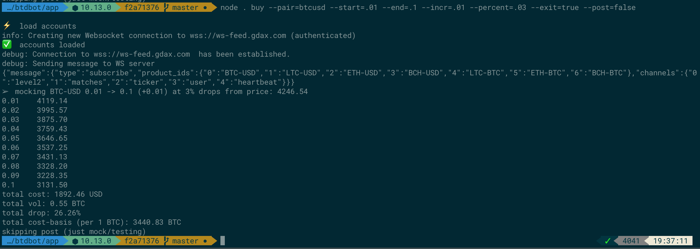

[Coinbase]: https://www.coinbase.com/join/antic

# Buy the Dip Bot (BTD Bot)

It's easier to buy the dip if you set limit orders escalating downward toward the lowest point you think it might go. That's what this tool does. Additionally, this tool provides a `sell` commmand that will set escalating sell orders to "sell the pump"

I am not a financial advisor, nor am I a professional market trader, nor a certified data scientist. Usage of this tool and data is entirely at your own risk.

> This is also a hodgepodge of code from an older bitcoin trading bot that I was working on which is currently unpublished. Some of the libraries and edges might show.

# Setup

* setup a [Coinbase Pro][Coinbase] account
* Get an [Coinbase Pro][Coinbase] API key/secret (I recommend limiting read/write usage to your IP address)
* Set `GDAX_KEY`, `GDAX_SECRET`, `GDAX_PASS` as env vars
* install node (recommend using [NVM](https://github.com/creationix/nvm))

# Usage

```
Usage:  <command> [options]

Commands:
  buy   🤖 buy the dip (place escalating order volumes at percentage drops from
        current price)
  dca   🤖 Dollar Cost Average buyer: Creates orders at intervals with a given
        dollar cost (e.g. node cli.js dca 100 .01 12; this will set 12 buy
        orders at 1% drops for $100 worth of BTC at each spot price)
  sell  🤖 sell the pump (place escalating order volumes at percentage rises from
        current price)

Options:
  -d, --debug    enable debug logging                                  [boolean]
  -f, --forever  continuous investment mode                            [boolean]
  -t, --test     test mode (no real trades)                            [boolean]
  -h, --help     Show help                                             [boolean]
  -v, --version  Show version number                                   [boolean]
```

# Examples



From here, if it looks right, I'll change `--post=false`, to `--post=true` and copy the output order lines to a spreadsheet where I can track the buys and total my cost-basis.

```
# BTC-USD
node . buy --pair=btcusd --start=.01 --end=.1 --incr=.01 --percent=.02 --exit=true --post=false

# LTC-USD
node . buy --pair=ltcusd --start=.01 --end=1 --incr=.05 --percent=.02 --exit=true --post=false

# ETH-USD
node . buy --pair=ethusd --start=.1 --end=1 --incr=.1 --percent=.04 --exit=true --post=false

# LTC-BTC - buys
node . buy --pair=ltcbtc --start=1 --end=10 --incr=1 --percent=.01 --exit=true --post=false 

# LTC-BTC - sells
node . sell --pair=ltcbtc --start=1 --end=10 --incr=1 --percent=.01 --exit=true --post=false 
```

## Dollar Cost Average buys

You may wish to buy a given dollar value at percentage drop points:
```
# buy $100 worth of BTC 10 times at 1% price drops from the current price
node . dca --pair=btcusd --cost=100 --times=10 --percent=.01 --exit=true --post=false
```

Or you may wish to rebuy bitcoin at a given percentage drop (for instance, if you spent the bitcoin on something else and are re-buying to get a discount on that item):
```
# buy $254 worth of bitcoin at 5% below the current price
node . dca --pair=btcusd --cost=254 --times=1 --percent=.05 --exit=true --post=false
```

## Author

Adam Eivy is a software architect by day and a drawing dad by night. Check out his latest project [Beetle Royale](http://beetleroyale.com) or [follow him on the interwebs](http://adameivy.com)


[](https://www.coinbase.com/checkouts/62b15a45f11194f8555884e200024616)
